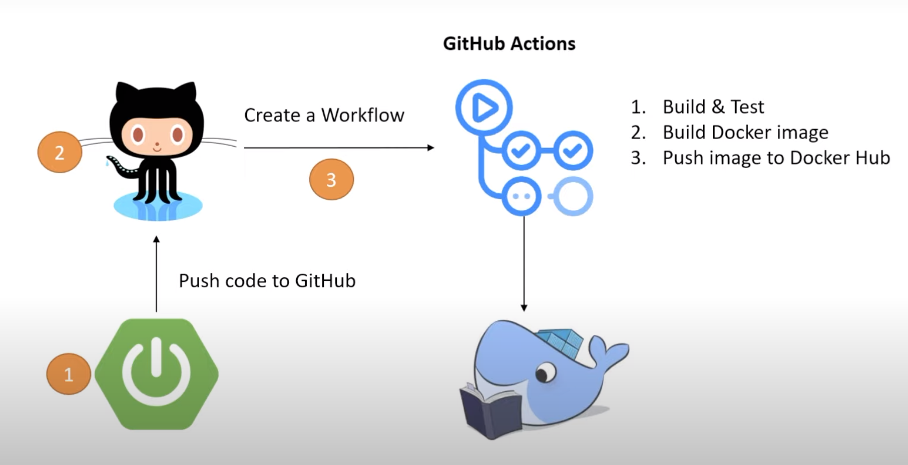
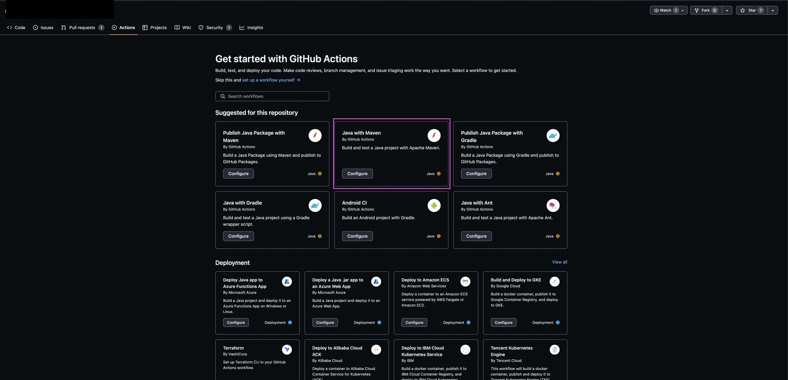
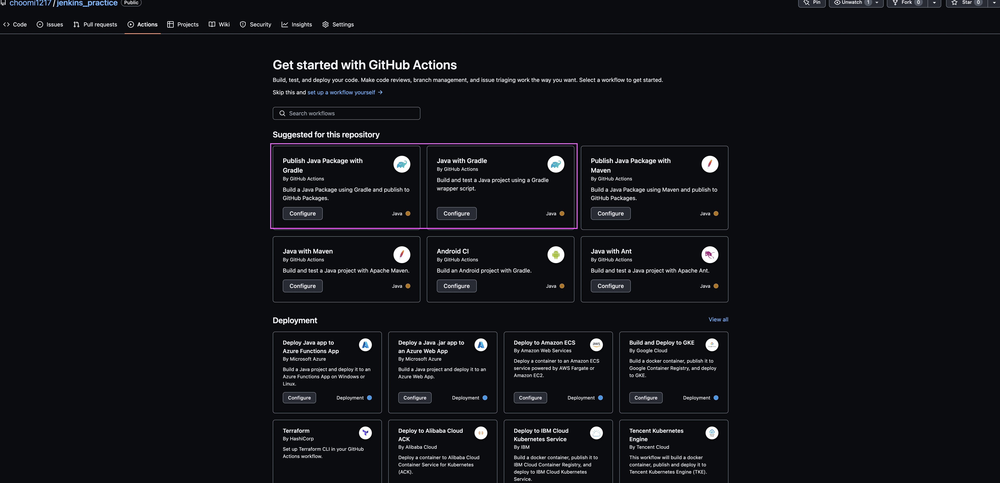
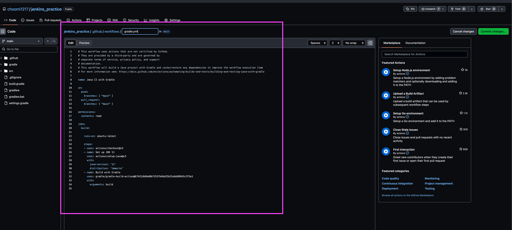
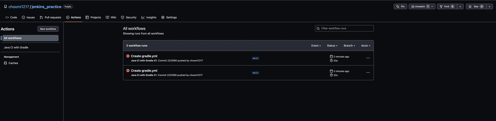
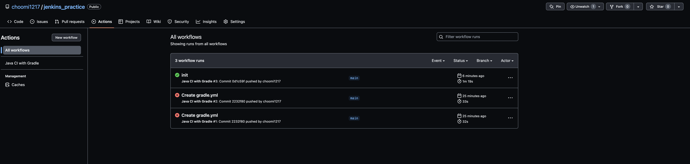
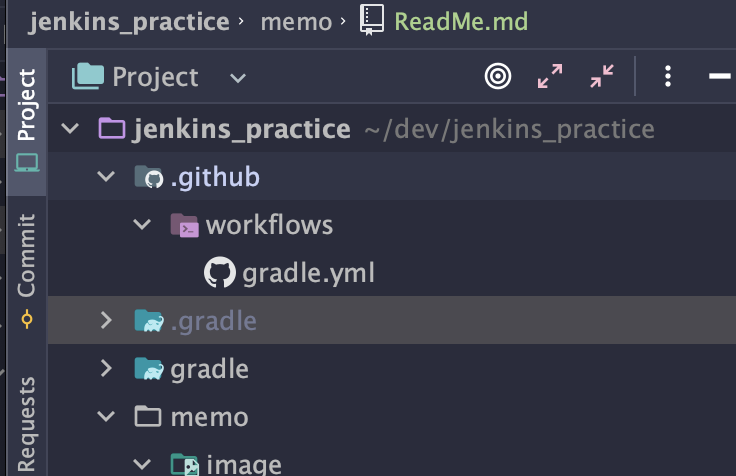
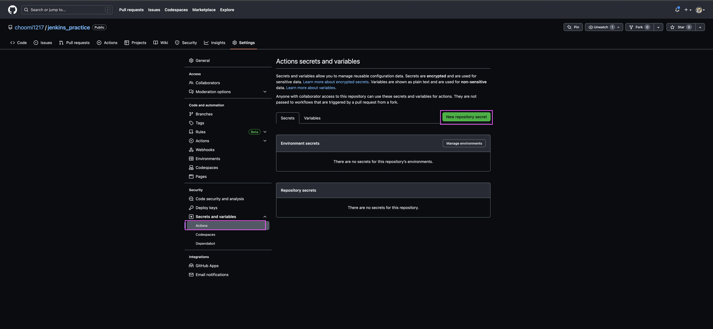
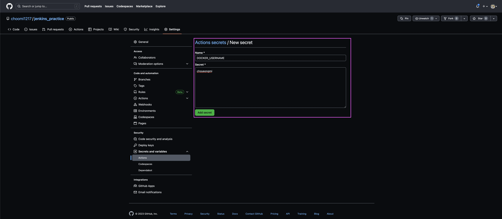

# 젠킨슨 설정



1. git에 project push
2. project action 설정
 

3. 아래처럼 yml 파일이 생김

4. 아래처럼 Action에 workflow가 생김


5. 로컬에서 추가한 yml 파일 pull로 땡겨옴

6. https://github.com/actions/checkout/tree/main/.github/workflows

7. 도커허브에 로그인
```yaml
- name: Build & push Docker image
  uses: mr-smithers-excellent/docker-build-push@v6
  with: 
      image: choyeongmi/git-action-repository
      tags: latest
      registry: docker.io
      dockerfile: Dockerfile
      username: ${{ secrets.DOCKER_USERNAME }}
      password: ${{ secrets.DOCKER_PASSWORD }}
```
[도커허브에 로그인 하기 위한 Basic usage](https://github.com/marketplace/actions/docker-build-push-action)
8. Dockerfile 추가하기
9. 프로젝트의 빌드 결과물의 이름주기
```text
tasks.named("jar") {
	getArchiveBaseName().set("git-action-repository")
}
```
10. 도커 이미지 만들기
    - Dockerfile은 Java 어플리케이션을 독립적으로 실행할 수 있는 Docker 이미지를 만듭니다
```docker
FROM openjdk:17 //Docker 이미지가 openjdk:17라는 기본 이미지 위에 만들어짐
EXPOSE 8080 //Docker 컨테이너가 8080 포트에서 네트워크 연결을 받을 것
ADD target/git-action-repository.jar git-action-repository.jar //빌드 컨텍스트의 target/git-action-repository.jar 파일을 이미지의 /git-action-repository.jar 위치에 추가합니다. 이 작업으로 컨테이너 안에 자바 어플리케이션의 실행 파일인 .jar 파일이 포함됩니다.
ENTRYPOINT ["java","-jar","git-action-repository.jar"] //Docker 컨테이너가 시작될 때 실행할 명령을 정의합니다. 이 경우에는 java -jar git-action-repository.jar 명령이 실행되어 .jar 파일이 실행됩니다
```
11. 도커 username, password 저장


12. git commit 후
13. github page 들어가서 git action 확인
8. 도커 이미지 빌드
9. 도커허브에 이미지 넣기 