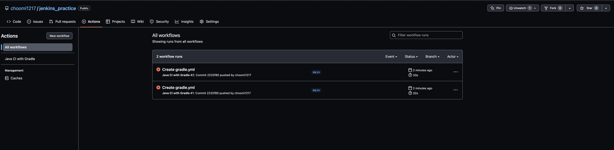

# 젠킨슨 설정

1. git에 project push
2. project action 설정
 

3. 아래처럼 yml 파일이 생김

4. 아래처럼 Action에 workflow가 생김

5. 로컬에서 추가한 yml 파일 pull로 땡겨옴

6. https://github.com/actions/checkout/tree/main/.github/workflows  에 가서  